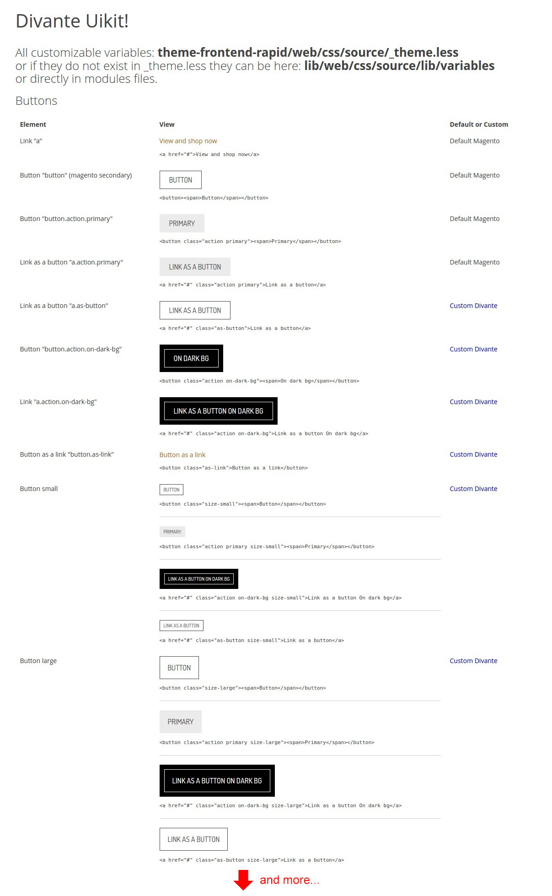

# Magento 2 Divante Uikit Module

The Divante Uikit module has been created for and as a dependency of [Divante Rapid Theme](https://github.com/DivanteLtd/magento2-rapid-theme).
UI Kit is a set of most common elements on the page. Buttons, typography, form elements, colors. By changing only these elements we can easily give our website the individual character, without costly and time-consuming design/customization process of individual views. This is a reasonable compromise between using a default skin and designing your own.

## Compatibility
* Same as for [Divante Rapid Theme](https://github.com/DivanteLtd/magento2-rapid-theme)
 
## Additional information
* Any additional information can be found directly on Uikit's website: [http://rapid.divante.co/uikit](http://rapid.divante.co/uikit)

#### Features on front

 
    
## License
* The Grouped Products Manager module is licensed under the terms of the MIT license.
    
## Standards & Code Quality
* This module respects all Magento2 code quality rules and our own PHPCS and PHPMD rulesets.

## Why use Magento 2 Divante Uikit module?
46% increase in revenue - this is how much you can achieve with an online shop. That’s why it’s the high time for you to start thinking seriously about your online store. Working with many Fashion eStores we learned from the habits of fashion eShops users. It helps us to create a product adjusted to their needs. See our [case studies](https://divante.co/case-studies/ "case studies"). 

## About Authors

    

We are a Software House from Europe, existing from 2008 and employing about 150 people. Our core competencies are built around Magento, Pimcore and bespoke software projects (we love Symfony3, Node.js, Angular, React, Vue.js). We specialize in sophisticated integration projects trying to connect hardcore IT with good product design and UX.

We work for Clients like INTERSPORT, ING, Odlo, Onderdelenwinkel or CDP, the company that produced The Witcher game. We develop two projects: [Open Loyalty](http://www.openloyalty.io/ "Open Loyalty") - loyalty program in open source and [Vue.js Storefront](https://github.com/DivanteLtd/vue-storefront "Vue.js Storefront").

We are part of the OEX Group which is listed on the Warsaw Stock Exchange. Our annual revenue has been growing at a minimum of about 30% year on year.

Visit our website [Divante.co](https://divante.co/ "Divante.co") for more information.
